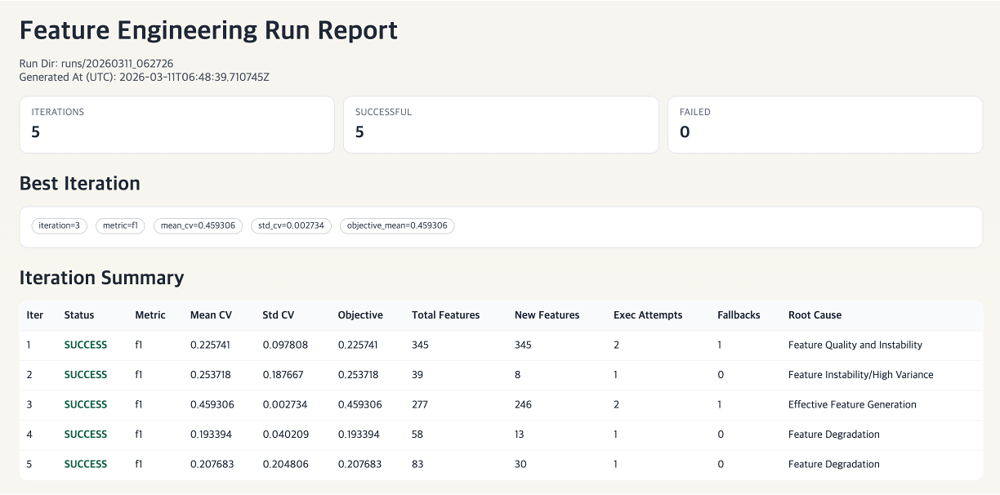

# 데이터 분석 agent 만들어서 공모전 Ssalmuck하기

📢 2026년 겨울학기 [AIKU](https://github.com/AIKU-Official) 활동으로 진행한 프로젝트입니다

## 소개

이 프로젝트는 정형 데이터를 다루는 데이터 경진 대회를 대상으로, LLM이 데이터 분석부터 feature engineering 구현까지 반복 수행하며 성능을 개선하는 자동화 에이전트입니다.

핵심 목표는 다음 두 가지입니다.
- 반복 가능한 실험 파이프라인으로 `runs/<RUN_ID>` 단위의 실험 이력을 남긴다.
- 최종적으로 제출 가능한 `submission_<RUN_ID>_iter_<ITERATION>.csv`를 자동 생성한다.

## 방법론

본 파이프라인은 "분석 → 가설 → 구현 → 검증 → 진단" 루프를 여러 iteration으로 수행하며, 성능이 개선되는 feature 블록을 누적/선택해 최종 제출에 반영합니다.


전체 흐름:
1. `Profiling`: 기본 EDA + 고정 correlation 분석 실행 후 insight 요약을 생성합니다.
2. `Hypothesis`: profiling 결과와 진단 이력을 바탕으로 전처리/피처 가설을 생성합니다.
3. `Implement`: 전처리 모듈과 feature block 모듈 코드를 생성합니다.
4. `Execute`: 생성 모듈을 조립해 CV를 수행하고 metric(`f1`/`rmse` 등)을 기록합니다.
5. `Diagnose`: 실패 원인/개선 포인트를 정리해 다음 iteration 프롬프트에 피드백합니다.
6. `Final Selection & Submission`: best iteration 또는 최종 선택된 모듈 조합으로 예측 후 제출 파일을 생성합니다.

## 환경 설정

1. Python 가상환경 생성 및 의존성 설치

```bash
python3 -m venv .venv
source .venv/bin/activate
python -m pip install --upgrade pip
pip install -r requirements.txt
```

2. 환경변수 설정 (`GEMINI_API_KEY`)

```bash
cp .env.example .env
```

`.env`에 아래 값을 설정합니다.

```bash
GEMINI_API_KEY=YOUR_API_KEY
```

3. 데이터/설정 파일 확인
- Dacon: `config/dacon.json`, `data/dacon/*`
- Kaggle: `config/kaggle.json`, `data/kaggle/*`

## 사용 방법

1. 전체 파이프라인 실행 + submission 생성

```bash
# 기본: config/dacon.json
./scripts.sh

# Kaggle 설정
./scripts.sh config/kaggle.json
```

2. 파이프라인을 생성한 후 특정 run으로 submission 생성

```bash
python -m main --config config/dacon.json
python -m main --config config/kaggle.json
```

```bash
# best iteration 자동 선택(기본)
python -m submission --config config/kaggle.json --run_id <RUN_ID>

# iteration 수동 지정
python -m submission --config config/kaggle.json --run_id <RUN_ID> --iteration <ITERATION>
```

결과 파일은 기본적으로 `submissions/*/submission_<RUN_ID>_iter_<ITERATION>.csv` 형식으로 저장됩니다.

## 예시 결과

아래는 파이프라인 실행 후 생성되는 대표 결과 구조입니다.  
(`RUN_ID=20260312_041232` 기준 예시)

```text
runs/
└── 20260312_041232/
    ├── config.json
    ├── task_context.json
    ├── report.json
    ├── report.html
    ├── baseline/
    │   ├── baseline_result.json
    │   └── baseline_cv_result.json
    ├── iteration_1/
    │   ├── profile/
    │   │   ├── profile.json
    │   │   ├── profile_basic.stdout.txt
    │   │   ├── profile_correlation.stdout.txt
    │   │   └── profile_insight.json
    │   ├── hypothesis/
    │   │   ├── web_research.txt
    │   │   ├── web_research.json
    │   │   └── hypothesis.json
    │   ├── implement/
    │   │   ├── preprocessor_module.py
    │   │   ├── feature_block_1.py
    │   │   ├── feature_block_2.py
    │   │   ├── feature_block_3.py
    │   │   ├── feature_block_4.py
    │   │   ├── feature_block_5.py
    │   │   ├── feature_blocks_manifest.json
    │   │   └── implement_summary.json
    │   ├── execute/
    │   │   ├── assembled_pipeline.py
    │   │   ├── cv_result.json
    │   │   ├── execute_result.json
    │   │   ├── execute_stdout.log
    │   │   └── execute_stderr.log
    │   └── diagnose/
    │       ├── diagnose.json
    │       └── diagnose_logs.json
    ├── iteration_2/
    ├── iteration_3/
    ├── iteration_4/
    ├── iteration_5/
    └── final/
        ├── final_selection.json
        └── execute/
```

각 단계 산출물 의미:
- `baseline/`: FE 적용 전 기준 성능(비교 기준점)
- `profile/`: EDA 코드/실행 로그/인사이트 요약
- `hypothesis/`: 웹 리서치 텍스트 + 전처리/피처 가설 JSON
- `implement/`: LLM이 생성한 전처리 모듈 + FE 블록 코드
- `execute/`: 조립된 파이프라인 실행 결과(CV 점수/로그)
- `diagnose/`: 다음 iteration 개선을 위한 진단 요약
- `final/final_selection.json`: 최종 선택된 preprocessor/feature block 정보
- `report.json`, `report.html`: 전체 iteration 결과 집계 리포트

submission 생성 후 파일 구조:

```text
submissions/
├── dacon/
│   └── submission_<RUN_ID>_iter_<ITERATION>.csv
└── kaggle/
    └── submission_<RUN_ID>_iter_<ITERATION>.csv
```

`submission.py` 실행 시 모델 아티팩트는 저장하지 않고, 제출용 CSV만 누적 저장됩니다.

`report.html`은 아래처럼 결과 대시보드 형태로 확인할 수 있습니다.



## 팀원

<table>
  <tr>
    <td align="center" valign="top">
      <br/>
      <b>팀장 김우진(7기)</b><br/>
      <a href="https://github.com/3sirn3203">@3sirn3203</a><br/>
    </td>
    <td align="center" valign="top">
      <br/>
      <b>박서연(6기)</b><br/>
      <a href="https://github.com/tigris-ignea">@tigris-ignea</a>
    </td>
    <td align="center" valign="top">
      <br/>
      <b>박주현(6기)</b><br/>
      <a href="https://github.com/JuHyeon1222">@JuHyeon1222</a>
    </td>
    <td align="center" valign="top">
      <br/>
      <b>백승우(6기)</b><br/>
      <a href="https://github.com/studipu">@studipu</a>
    </td>
    <td align="center" valign="top">
      <br/>
      <b>장국영(6기)</b><br/>
      <a href="https://github.com/hansimboy">@hansimboy</a>
    </td>
  </tr>
</table>
