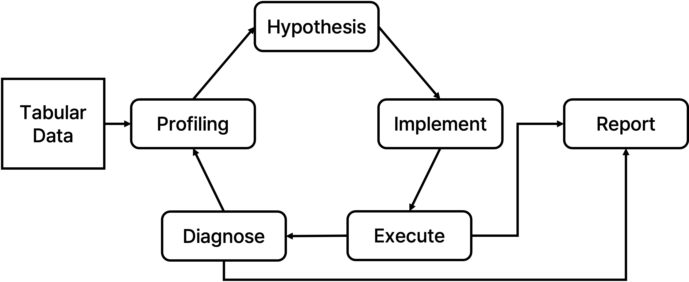

# 26-Winter Project: LLM 기반 Tabular Feature Engineering



## 프로젝트 개요

이 프로젝트는 **LLM Agent를 이용해 tabular 데이터 전처리/피처 엔지니어링 코드를 반복 개선**하고,  
검증 결과를 바탕으로 다음 iteration 전략을 자동으로 갱신하는 파이프라인입니다.

- 실행 엔트리포인트: `main.py`
- 오케스트레이션: `src/orchestrator.py`
- 실행 결과: `runs/<run_id>/...`

---

## 프로젝트 디렉토리 구조

```text
.
├── assets/
│   └── figure.png
├── config/
│   └── dacon.json
├── data/
│   ├── dacon/
│   └── kaggle/
├── runs/
│   └── <run_id>/
│       ├── config.json
│       ├── report.html
│       ├── report.json
│       └── iteration_<n>/
│           ├── profile/
│           ├── hypothesis/
│           ├── implement/
│           ├── execute/
│           └── diagnose/
├── src/
│   ├── orchestrator.py
│   ├── val_wrapper.py
│   ├── prompt/
│   │   ├── 1_profile.j2
│   │   ├── 2_hypothesis.j2
│   │   ├── 3_implement_prep.j2
│   │   ├── 3_implement_fe.j2
│   │   ├── 5_diagnose.j2
│   │   └── 6_report.j2
│   └── modules/
│       ├── profile.py
│       ├── hypothesis.py
│       ├── implement.py
│       ├── execute.py
│       ├── diagnose.py
│       ├── report.py
│       └── validator.py
├── baseline/
│   ├── baseline.py
│   └── config/
└── submission.py
```

---

## 실행 방법

### 1) 환경 준비

```bash
pip install -r requirements.txt
```

`.env` 파일에 Gemini API Key를 설정합니다.

```bash
GEMINI_API_KEY=your_api_key
```

### 2) 파이프라인 실행

```bash
python3 main.py --config config/dacon.json
```

실행이 끝나면 `runs/<run_id>/` 하위에 iteration별 결과와 `report.html`이 생성됩니다.

### 3) 생성된 모듈 + AutoGluon으로 제출 파일 생성

```bash
python3 submission.py --config config/dacon.json --run_id <run_id>
```

`submission.data.output_path`에 `submission.csv`가 저장됩니다.

---

## 실행 단계별 역할

오케스트레이터는 각 iteration마다 아래 단계를 순서대로 수행합니다.

### 1. Profiling (`src/modules/profile.py`)

- LLM이 EDA 코드를 생성하고 실행하여 데이터 특성을 분석합니다.
- 결과는 `profile/profile.json` 등에 저장됩니다.
- 이전 iteration의 diagnose 결과가 있으면 핵심 피드백을 같이 반영합니다.

### 2. Hypothesis (`src/modules/hypothesis.py`)

- Profiling 결과를 바탕으로 전처리/피처엔지니어링 가설을 생성합니다.
- 출력은 `hypothesis/hypothesis.json`으로 저장됩니다.

### 3. Implement (`src/modules/implement.py`)

- 가설을 기반으로 실제 실행 가능한 코드(`preprocessor.py`, `feature_engineering.py`)를 생성합니다.
- 문법 체크 및 인터페이스 계약(validator 호환) 스모크 체크를 수행합니다.
- 실패 시 재생성(설정 기반 재시도)이 가능합니다.

### 4. Execute (`src/modules/execute.py`)

- `src/val_wrapper.py`를 호출해 생성 코드의 성능을 검증합니다.
- CV 결과(`cv_result.json`), 표준 출력/에러 로그를 저장합니다.
- 하드 실패 시 implement fallback(재생성 후 재실행)을 수행할 수 있습니다.

### 5. Diagnose (`src/modules/diagnose.py`)

- LLM이 execute 결과(점수/로그/비교 정보)를 분석합니다.
- 다음 iteration에서 사용할 구체적 피드백을 생성합니다.
- 출력은 `diagnose/diagnose.json`으로 저장됩니다.

### 6. Report (`src/modules/report.py`)

- 전체 iteration 결과를 취합해 `report.html`, `report.json`을 생성합니다.
- iteration별 성능, diagnose 요약, feature 관련 정보 등을 확인할 수 있습니다.

---

## 주요 산출물

- `runs/<run_id>/iteration_<n>/profile/profile.json`
- `runs/<run_id>/iteration_<n>/hypothesis/hypothesis.json`
- `runs/<run_id>/iteration_<n>/implement/preprocessor.py`
- `runs/<run_id>/iteration_<n>/implement/feature_engineering.py`
- `runs/<run_id>/iteration_<n>/execute/cv_result.json`
- `runs/<run_id>/iteration_<n>/diagnose/diagnose.json`
- `runs/<run_id>/report.html`
- `runs/<run_id>/report.json`

---

## 참고

- `baseline/`은 LLM 없이 AutoGluon만 사용하는 비교 실험용 baseline입니다.
- `config/dacon.json`에서 iteration 수, 모델, 토큰 수, validation 옵션 등을 조절할 수 있습니다.
